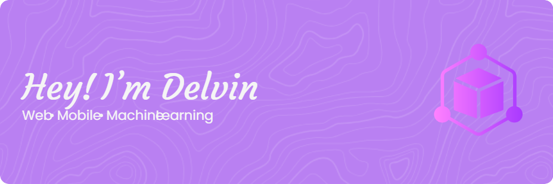

<p align="center">
  
</p>

<h1 align="center">Hi, I'm Delvin De Vito 👋</h1>

<h3 align="center">
  Software Engineer • Full-Stack & Mobile Developer • AI Enthusiast
</h3>

<p align="center">
  I build practical software across web, mobile, backend systems, and intelligent applications.
</p>

<p align="center">
  <strong>Turning ideas into scalable software, one system at a time.</strong>
</p>

---

## 👨‍💻 About Me

I'm **Delvin**, a **Software Engineer** and the developer behind **VitoTechLab**, a personal initiative where I design, build, and experiment with real-world software.

My primary focus is **software engineering**, covering full-stack development, mobile applications, backend systems, databases, and infrastructure. Alongside that, I'm an **AI enthusiast** who enjoys exploring machine learning, computer vision, NLP, predictive analytics, and practical AI integrations.

I enjoy working across the entire development lifecycle — from **UI/UX and architecture**, to APIs, databases, deployment, infrastructure, and intelligent features.

Currently exploring and building around:

* ⚙️ **Software Engineering & System Architecture**
* 🌐 **Full-Stack Web Development**
* 📱 **Cross-Platform & Native Mobile Development**
* 🔙 **Backend Engineering & API Design**
* 🧠 **Machine Learning & Applied AI**
* 🗄️ **Database Design & Data Architecture**
* 🐳 **Containers, Linux & Infrastructure**
* 🔄 **Real-Time Systems & Automation**

---

## 💻 Programming Languages

       

---

## 🌐 Frontend Engineering

    

Also working with **React Query, Redux, React Hook Form, responsive UI architecture, component-driven development, and mobile-first design**.

---

## 📱 Mobile Engineering

   

Working with **cross-platform architecture, native Android, state management, API integration, authentication, local persistence, notifications, and real-time applications**.

---

## 🔙 Backend Engineering

     

Experienced with:

`REST APIs` · `Authentication` · `Authorization` · `RBAC` · `Background Jobs` · `Real-Time Systems` · `Webhooks` · `Third-Party Integrations`

---

## 🗄️ Database & Data Layer

### Databases

   

### ORM & Data Access

  

### Backend Platforms

  

---

## 🧠 AI & Machine Learning

    

Interested in applying AI as part of real software systems rather than treating it as a standalone experiment.

`Machine Learning` · `Deep Learning` · `NLP` · `Computer Vision` · `Predictive Analytics` · `RAG` · `AI Integration`

---

## ☁️ Infrastructure & DevOps

     

Working with **containerized environments, Linux servers, deployment workflows, version control, and infrastructure experimentation**.

---

## 🎨 Design & Development Tools


I care about the engineering behind a product, but also how it **looks, feels, and behaves for the people using it**.

---

## ⚡ Engineering Interests

```text
Software Engineering       Backend Architecture
System Design               Mobile Engineering
Full-Stack Development      API Design
Database Architecture       Real-Time Systems
Machine Learning            Applied AI
DevOps & Containers         Automation
UI/UX Engineering           Open Source
```

---

## 🌐 Connect

[](https://instagram.com/delvin_dv)

---

## 🕹️ Contributions

<picture>
  <source
    media="(prefers-color-scheme: dark)"
    srcset="https://raw.githubusercontent.com/Vito28/Vito28/output/pacman-contribution-graph-dark.svg"
  >
  <source
    media="(prefers-color-scheme: light)"
    srcset="https://raw.githubusercontent.com/Vito28/Vito28/output/pacman-contribution-graph.svg"
  >
  
</picture>

---

<p align="center">
  <strong>Build. Learn. Iterate. Ship.</strong>
</p>
